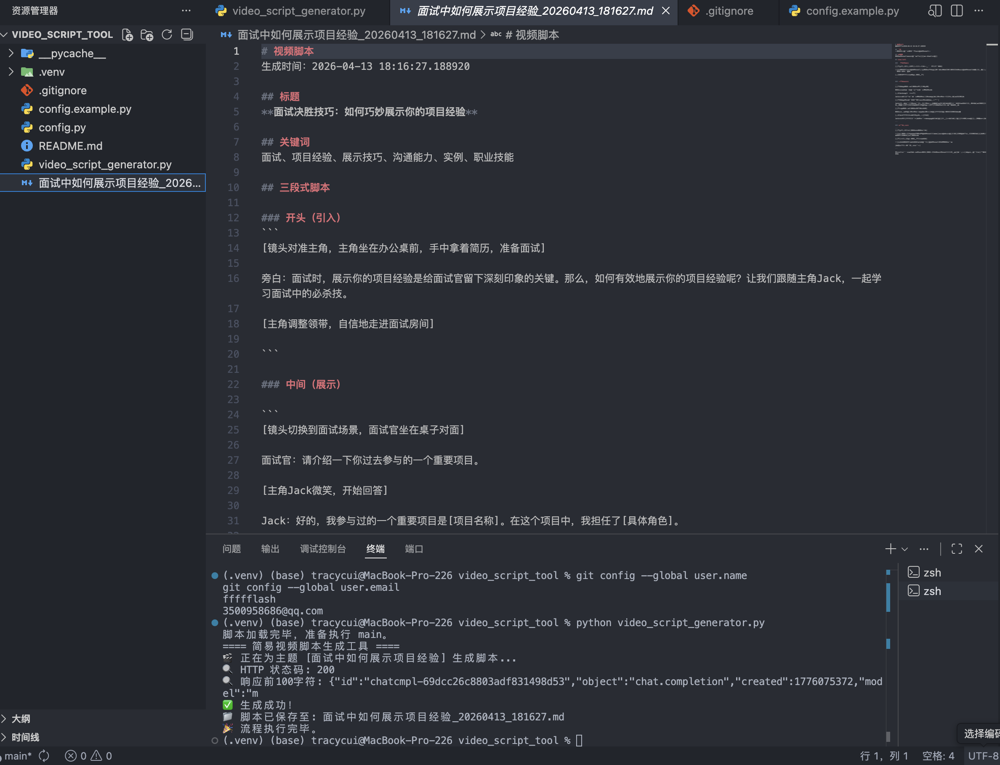

# 🎬 AI 视频脚本自动生成工具

> 输入一个主题，秒出结构化短视频脚本 —— 让 AI 帮你搞定文案创作的第一公里。

[](https://www.python.org/)
[](LICENSE)
[](#-关于-vibe-coding)

<p align="center">
  
</p>

## 📌 项目背景

短视频时代，**写脚本**是每个创作者最头疼的第一步。  
传统方式下，从构思选题到写出一个完整的分镜脚本，动辄需要 30 分钟以上。

本项目旨在验证一个想法：  
**能否用大模型把“主题”直接变成“可直接口播的结构化脚本”，把创作流程压缩到 2 分钟以内？**

答案是可以的。这就是一个 **AI 辅助内容创作的 MVP（最小可行性产品）原型**。

## ✨ 核心功能

- ✅ **主题输入，秒级生成**：输入视频主题，调用大模型 API 自动生成三段式脚本（钩子-干货-结尾引导）。
- ✅ **结构化输出**：强制模型输出包含标题、关键词、分段时间戳的 Markdown 格式，便于直接导入剪映等剪辑软件作为提词器。
- ✅ **自动化流程串联**：从主题输入 → API 调用 → 文本生成 → 本地 Markdown 文件保存，全流程一键串联。
- ✅ **优雅降级设计**：当 API 不可用时，自动降级为本地演示模板，保证流程不中断（体现工程鲁棒性思考）。

## 🛠️ 技术栈

| 模块           | 技术选型                         |
| -------------- | -------------------------------- |
| 编程语言       | Python 3.9+                      |
| 大模型接口     | Moonshot AI (Kimi) 兼容 OpenAI 格式 |
| 配置管理       | 外部 config.py 文件（不入库）     |
| 开发模式       | Vibe Coding（AI 辅助生成 + 人工调试） |
| 版本控制       | Git & GitHub                     |

## 🚀 快速开始

### 1. 克隆仓库

```bash
git clone https://github.com/你的用户名/ai-video-script-generator.git
cd ai-video-script-generator
pip install requests
# 复制配置文件模板
cp config.example.py config.py

# 用文本编辑器打开 config.py，填入你的 Kimi API Key
# API Key 获取地址：https://platform.moonshot.cn/console/api-keys

python video_script_generator.py
.
├── video_script_generator.py   # 主程序入口
├── config.example.py           # 配置文件模板（公开）
├── .gitignore                  # 忽略敏感文件与生成物
├── README.md                   # 项目说明文档
└── screenshot.png              # 运行效果截图

# 视频脚本
生成时间：2026-04-13 17:20:00

## 🎯 视频标题：面试中如何展示项目经验 | 3步让面试官追着你问

### 🔑 核心关键词
`STAR法则` `数据量化` `埋钩子技巧` `Vibe Coding`

### 📽️ 脚本正文

【0-5秒 钩子】
面试官让你“介绍项目”，80%的人一开口就输了...

【6-30秒 干货】
第一步：用 STAR 原则重构经历...
第二步：把“效果很好”改成“效率提升 40%”...
第三步：故意留技术名词引导追问...

【31-45秒 结尾】
这套方法论来自我实际项目的复盘...
